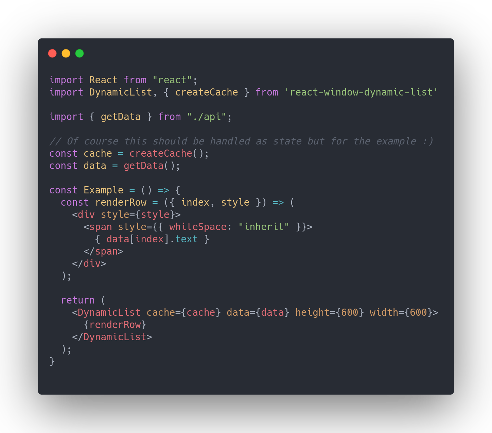

# react-window-dynamic-list

> Made with the awesome [create-react-library](https://github.com/transitive-bullshit/create-react-library)

[](https://www.npmjs.com/package/react-window-dynamic-list) [](https://www.npmjs.com/package/react-window-dynamic-list) [](https://standardjs.com)

## How is this different from `react-window`?

This library comes to partly solve the case of rendering dynamically sized items with [react-window](https://github.com/bvaughn/react-window).
For more information about the issue please read [this thread](https://github.com/bvaughn/react-window/issues/6).  
Before you overjoy please read the [limitations](#warning-requirements-and-limitations-warning) of this approach down bellow :sleepy:

## Demo

👉 [check out dynamic list in action](https://gnir-work.github.io/react-window-dynamic-list/)

## Install

```bash
npm install --save react-window-dynamic-list
```

## Usage



Yep. its that simple :satisfied:

## API

The api is the same as [VariableSizeList](https://react-window.now.sh/#/api/VariableSizeList) with some small changes and additions.

#### Changes

1. Instead of `itemCount` you must pass `data` ([read more](#additions))
2. We handle `itemSize` and `estimatedItemSize` for you :sunglasses:

#### Additions

| Property                | Type     | Required? |             Default             | Description                                                                                                                                                  |
| :---------------------- | :------- | :-------: | :-----------------------------: | :----------------------------------------------------------------------------------------------------------------------------------------------------------- |
| data                    | Object[] |     ✓     |                                 | All of the data that will be displayed in the list. <br />Each `object` must contain an unique `id` field.<br />For example: `[{id: 1, ...}, {id: 2, ....}`] |
| cache                   | Object   |     ✓     |                                 | The cache object which the list will use for caching the calculated sizes.<br />Check the [example](#usage) for how to create it.                            |
| lazyMeasurement         | boolean  |           |             `true`              | Wether the application should fill the cache in the background.<br />For more information read the [caching section](#caching).                              |
| recalculateItemsOnResize | Object   |           | `{ width: true, height: true }` | Wether the list should recalculate the items size if its own size has changed.                               |

## Implementations details

### TL;DR:

Just in time measurement with caching in the background.

### Details:

The algorithm is divided into two main concepts:

#### Just in time measurements:

We measure each item in the list by temporary rendering it with `react-dom` in a different application.
For more information please read [this great article](https://medium.com/trabe/measuring-non-rendered-elements-in-react-with-portals-c5b7c51aec25).

#### Caching:

In order for just in time measurements to be effective we need to cache the measurements.  
Currently there are two caching modes:

1. Cache only the items that were rendered
2. On top of caching the rendered items a background task will measure each element and fill the cache.  
   This is the **default behavior** as it gives a significant performance boost, especially in case of manipulating the data before scrolling through it.  
   In exchange there is a mild slow down in overall performance in the first couple of seconds.

## :warning: Requirements and Limitations :warning:

1. Your data doesn't change its size.
   - Your items size must be determined on mount (No `ajax` or images).
2. Currently only supports vertical layout. (didn't have time to implement support for horizontal)
3. All of the styling regarding the items **must** be `inline` or not affected by location in the `DOM`.
4. Changes to the list's scrollbar, especially the width, should effect all of the scrollbars in the application.
   - Since we pre render the items in order to measure them the size of the scrollbar is important in the pre rendered item as well.

## License

MIT © [gnir-work](https://github.com/gnir-work)
